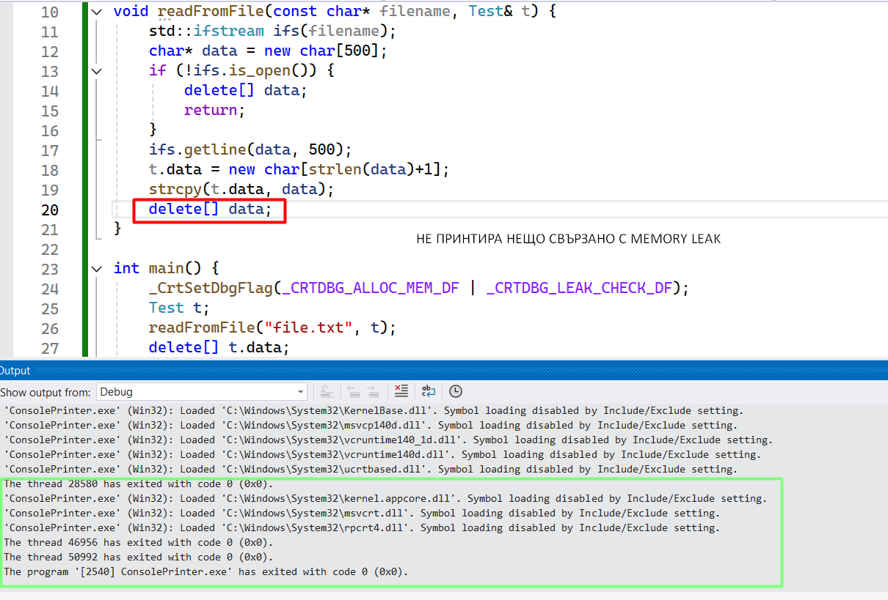
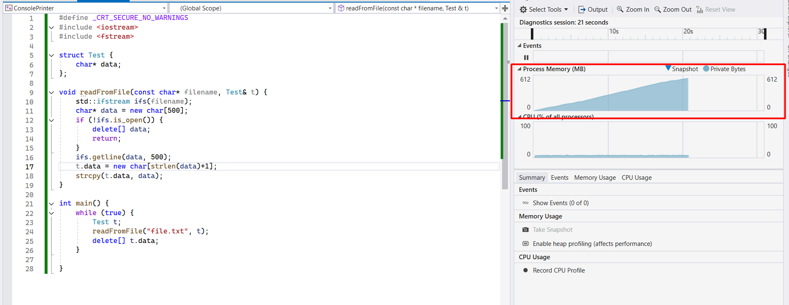

### Memory leak (Утечка на памет) възниква, когато динамично заделената памет не се освобождава коректно. Това може да доведе до увеличаване на използваната памет и евентуален срив на програмата.

## 🔍 Как да открием Memory Leak в C++?
### 1. Пуснете програмата в <u>DEBUG MODE</u>.

### *Има 2 начина:*

## Кода който ще използваме за memoryLeak!!!
```c++
#include <iostream>
#include <fstream>

struct Test {
    char* data;
};
void readFromFile(const char* filename, Test& t) {
    std::ifstream ifs(filename);
    char* data = new char[500];
    if (!ifs.is_open()) {
        delete[] data;
        return;
    }
    ifs.getline(data, 500);
    t.data = new char[strlen(data) + 1]; 
    strcpy(t.data, data);
    // Липсва `delete[] data;` тук
}

int main() {
    Test t;
    readFromFile("file.txt", t);
    delete[] t.data; // Освобождава само `t.data`, но `data` остава заделена
}
```

## ПЪРВИ НАЧИН:
Добавете:
```c++
#include <crtdbg.h>

// в началото на main
_CrtSetDbgFlag(_CRTDBG_ALLOC_MEM_DF | _CRTDBG_LEAK_CHECK_DF);
```
```c++
#include <iostream>
#include <fstream>
#include <crtdbg.h> // Добавяне на Debugging функционалност

struct Test {
    char* data;
};
void readFromFile(const char* filename, Test& t) {
    std::ifstream ifs(filename);
    char* data = new char[500];
    if (!ifs.is_open()) {
        delete[] data;
        return;
    }
    ifs.getline(data, 500);
    t.data = new char[strlen(data) + 1]; 
    strcpy(t.data, data);
    delete[] data; // Освобождаване на временно заделената памет
}

int main() {
    _CrtSetDbgFlag(_CRTDBG_ALLOC_MEM_DF | _CRTDBG_LEAK_CHECK_DF); // Активиране на Debugging за Memory Leaks
    Test t;
    readFromFile("file.txt", t);
    delete[] t.data; // Коректно освобождаване на паметта
}
```
---
#### Натисните на <u>output</u> долу до <u>Error List</u>
### ❌ Memory Leak Detected


### ✅ No Memory Leak (Fixed Code)


# ВТОРИ НАЧИН:

## Поставяме си изпълнението на кода в един безкраен цикъл и като го стартираме в DEBUG mode Отдясно на <u>**_Process Memory_**</u> ни показва използваната памет на програмата!
```c++
#include <iostream>
#include <fstream>
struct Test {
    char* data;
};
void readFromFile(const char* filename, Test& t) {
    std::ifstream ifs(filename);
    char* data = new char[500];
    if (!ifs.is_open()) {
        delete[] data;
        return;
    }
    ifs.getline(data, 500);
    t.data = new char[strlen(data)+1];
    strcpy(t.data, data);

}

int main() {
    while(true) {
        Test t;
        readFromFile("file.txt", t);
        delete[] t.data;
    }
}
```

🔴 **Грешка:** Вижте, че **_Process Memory (MB)_** постоянно нараства, което означава, че паметта не се освобождава.

## 📸 Memory Leak Detection Screenshots

### ❌ Memory Leak Detected


🟢 **Поправено:** Вижте, че **_Process Memory (MB)_** остава стабилна, което означава, че паметта се освобождава правилно.
### ✅ No Memory Leak (Fixed Code)

