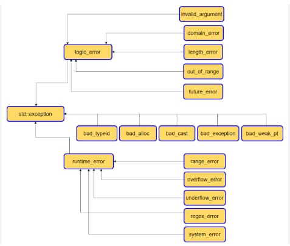

# ООП Практикум - Blitz Test #2 - 16.04.2025

#### 1. Какво ще се изведе на конзолата след изпълнението на следния код?

```c++
class A {
	int a;
public:
	A() {
		std::cout << "Default of A\n";
		throw "test";
	}
	A(int a) : a(a) {}
};
class B {
	A a;
public:
	B() {
		std::cout << "Default constructor of B\n";
	}
	B(A a) {
		this->a = a;
		std::cout << "Constr with param\n";
	}

	B(const B& other) {
		std::cout << "Copy constr\n";
		this->a = other.a;
	}

};
int main() {
	B t1(10);
	B t2(t1);
}
```

**Отговор**:

```
Default of A
```
При създаване на първото B, се извиква констуктор на член-данната му от тип А. В конструктора на А първо се принтира "Default of A" и след това се хвърля грешка. Тази грешка не бива обработена никъде, следователно програмата приключва. 

---

#### 2: Какво ще се случи след изпълнението на следния код:
```c++
class User {
	char* name;
public:
	User(const char* name) {
		this->name = new char[strlen(name) + 1];
		strcpy(this->name, name);
	}

	User(const User& other) {
		this->name = new char[strlen(other.name) + 1];
		strcpy(this->name, other.name);
	}

	User(User&& other) noexcept {
		name = other.name;
		other.name = nullptr;
		throw "test";
		std::cout << "Move constr\n";
	}

	User& operator=(const User& other) = delete;
	~User() {
		delete[] name;
	}

};
int main() {

	User user1("Ivan");
	User user2(std::move(user1));
}
```

**Отговор**:

Първо се извиква конструктора на `User`, приемащ `const char*`, при създаването на `user1`. След това се извиква move конструктора, в който обаче се хвърля грешка. Понеже няма try-catch блок, който да обработи грешката, програмата приключва.

---

#### 3. Защо не е препоръчително да се хвърлят грешки в деструктора? Обосновете се и дайте пример.

**Отговор**:

Припомнете си за **_stack unwinding_** + в деструкторите НИКОГА НЕ хвърляме грешки - може да се поддържа само едно изключение едновременно и ако се хвърли ново, се вика `std::terminate()` и програмата се прекратява

---

#### 4. Какво ще се отпечата на конзолата?

```c++
#include <iostream>

struct A {
    A() {
        static unsigned count = 0;
        std::cout << "A()" << std::endl;
        if (count == 3) {
            throw std::runtime_error("Error!");
        }
        count++;
    }

    ~A() {
        std::cout << "~A()" << std::endl;
    }
};

struct B {
    B() {
        std::cout << "B()" << std::endl;
    }

    ~B() {
        std::cout << "~B()" << std::endl;
    }
};

struct C {
    C() {
        std::cout << "C()" << std::endl;
    }

    ~C() {
        std::cout << "~C()" << std::endl;
    }
};

class X {
    A a;
    B b;
    C c;

public:
    X() {
        std::cout << "X()" << std::endl;
    }

    ~X() {
        std::cout << "~X()" << std::endl;
    }
};

constexpr int MAX_SIZE = 10;

int main() {
    try {
        X arr[10];

    } catch (std::exception& e) {
        std::cout << e.what() << std::endl;
    }
}
```

**Отговор**:
```
A()
B()
C()
X()
A()
B()
C()
X()
A()
B()
C()
X()
A()
~X()
~C()
~B()
~A()
~X()
~C()
~B()
~A()
~X()
~C()
~B()
~A()
Error!
```
---

#### 5. Нека приемем, че съществува функция `f()` такава, че в нея има възможност за хвърляне на следните exception-и:

- `std::exception`
- `std::runtime_error`
- `std::range_error`   

Разпишете `try-catch` блок за функцията `f()`.

**Отговор**:

```c++
try {
    f();
} catch(const std::range_error& e) {
    //...
} catch(const std::runtime_error& e) {
    //...
} catch(const std::exception& e) {
    //...
}
```

---
#### 6. Какво ще изведе кода?
```c++
#include <iostream>
void f(int);

void (*fp)(int) = nullptr;

void g(int n) {
    static int count = 0;
    count += n;
    std::cout << count << " ";

    if (count < 10) {
        fp = f;
        fp(count + 1);
    }
}

void f(int n) {
    static int count = 0;
    count += n;
    std::cout << count << " ";

    if (count < 10) {
        fp = g;
        fp(count + 1);
    }
}
int main()
{
    fp = f;
    fp(1);
}
```

**Отговор:**
```
1 2 4 7 12
```

---

#### 7. Кои от следните оператори можем да предефинираме?

- `::` (scope resolution)  
- `&&` (and)  
- `sizeof`  
- `()` (function call)


**Отговор:**
`&&` и `()`

---

#### 8. Вярно ли е, че когато предефинираме оператор, можем да променим броя на неговите параметри?

**Отговор:**

Не. При предефинирането на оператор **не могат** да се променят *приоритета*, *асоциативността*, *броят* и *позицията* на аргументите му.

---

#### 9. Разгледайте по-долу разписания фрагмент. Ще се компилира ли успешно той?

```cpp
class Test {
    void operator[](std::string x) {}
};
```
a. Да 

b. Не, защото operator[] е private функция

c. Не, защото operator[] не е void 

d. Не, защото параметърът на operator[] е std::string, а трябва да бъде std::size_t

**Отговор:**

а. Да

---

#### 10. Нека е дадена следната дефиниция: 
class A { public: int arr[10];}; 
Да приемем, че желаем да дефинираме операторна функция, такава че след 
изпълнението на оператора ``a2 = 3 + a1``; да е изпълнено ``a2.arr[i] == 3 + a1.arr[i]``, за всяко i от 0 до 9, където a1 и a2 са обeкт и от клас А. Как трябва да се реализира 
``оператора +`` ? 
a. Вътрешен операторен метод със сигнатура void operator+(int, const A&) 
b. Вътрешен операторен метод със сигнатура A operator+(int, const A&) 
c. Външен за класа оператор void operator+(int, const A&) 
d. Външен за класа оператор A& operator+(int, const A&) 
e. Външен за класа оператор A operator+(int, const A&)

**Отговор:**

`operator+` ще бъде външна функция за класа, понеже очакваме да приема число като ляв аргумент. Ако бяхме дефинирали `operator+` като вътрешна член ф-я, то тогава автоматично левият аргумент щеше да е указателят `this`.

```cpp
class A {
public: 
    int arr[10];
    size_t size;
    // ...
};

A operator+(int num, const A& a) {
    A result;
    for (int i = 0; i < a.size; i++) {
        result.arr[i] = a.arr[i] + num;
    }
    return result;
}

```

**Важно**: Класът А по условие не е добре капсулиран! По - правилно би било член данната `arr` да е `private`.
Тогавва ще трябва да декларираме външната функция `operator+`, като приятелска за класа `А`.
Тогава отговорът би изглеждал така:

```cpp
class A {
private: 
    int arr[10];
    size_t size;
    // ...
public:
    //...
    friend A operator+(int num, const A& a);
};

A operator+(int num, const A& a) {
    A result;
    for (int i = 0; i < a.size; i++) {
        result.arr[i] = a.arr[i] + num;
    }
    return result;
}

```