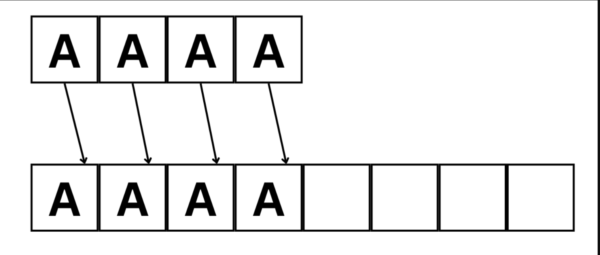
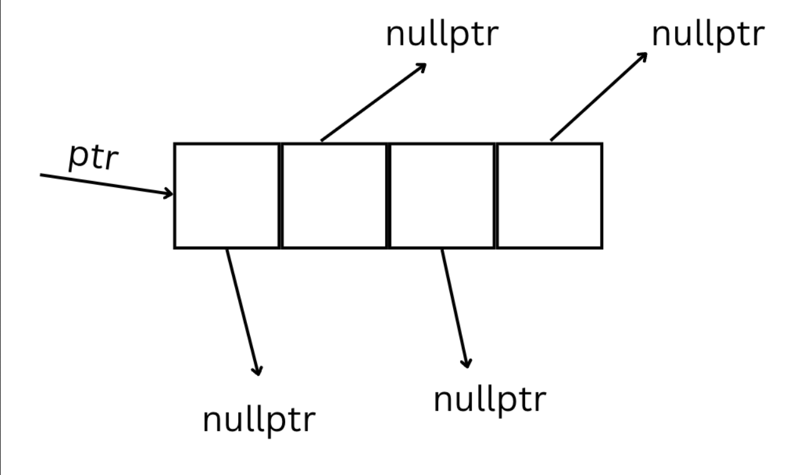
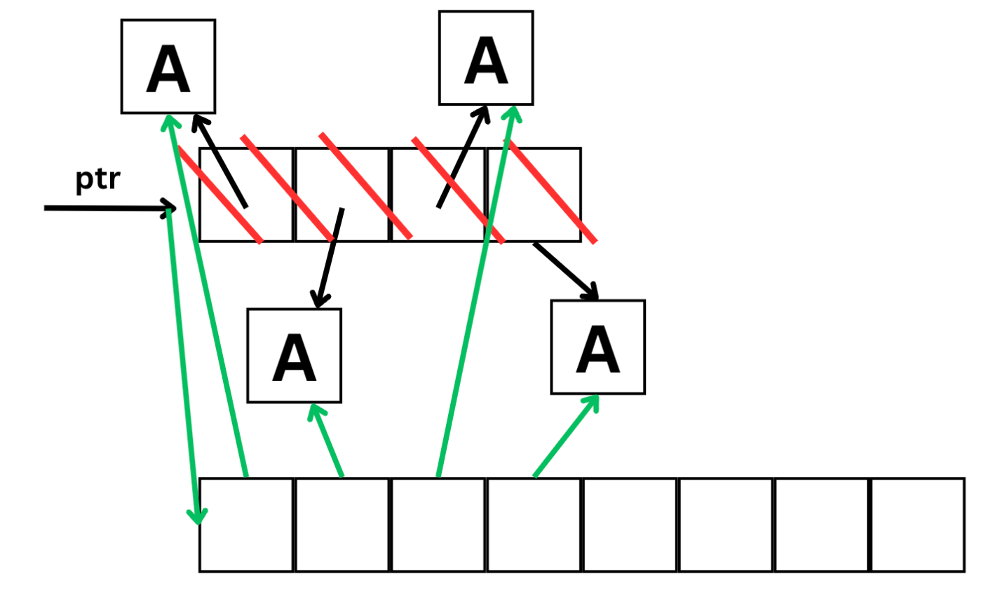

# Композиция на обекти. Масиви от обекти. Масиви от указатели към обекти. Move семантики.
## Композиция
Композиция – класове като елементи на други класове (влагане на класове). <br/>
Един клас може да включва в себе си обекти от други класове като член-данни. <br/> 
Когато обект от даден клас се дефинира, автоматично се извиква неговият конструктор. <br/> 
Ако класът съдържа член-данни, в неговия конструктор трябва да се укаже кои конструктори на член-данните да се извикват. <br/> 

#### Пример 1
```c++
class A
{
 .
 .
 .
}
class B
{
	 int n;
	 A obj;
}
 ```
В тази ситуация се извикват **default-ните конструктори на n и obj**. <br/> 

#### Пример 2
```c++
class A
{
	A(int a, int b)
 .
 .
 .
}
class B
{
	B() : obj(1, 2)
	{}
	
	int n;
	A obj;
}
 ```
Тук A няма default-ен конструктор. Това означава, че в конструктора на B трябва да се извика **експлицитно** някой от неговите конструктори. <br/>

### Композиция на обекти с динамична памет
Когато имаме композиция и в главния клас има динамично заделяне на памет, то трябва в реализацията на копи-конструктора и оператор=  **експлицитно** да се извикват копи-конструкторите и оператора = за всички член-данни (композирани обекти). 
```c++
class B;

class A
{
	void copyFrom(const A& other)
	{
		arr = new int[other.size];
		for (size_t i = 0; i < other.size; i++)
			arr[i] = other.arr[i];
		size = other.size;
	}
	void free()
	{
		delete[] arr;
	}

public:
	B nestedObject;
	int* arr; //dynamic array
	size_t size; 
  
	A(int n) : size(n)
	{
		arr = new int[n];
	}
	A(const A& other) : nestedObject(other.objTest), size(other.size)
	{
		copyFrom(other);
	}
	A& operator=(const A& other)
	{
		if (this != &other)
		{
			nestedObject= other.nestedObject;
			free();
			copyFrom(other);
		}
		return *this;
	}

	~A()
	{
		free();
	}
};
 ```
**ВАЖНО**: Деструкторите на член-данните **НЕ** трябва да се извикват експлицитно в деструктора на класа.

---
## Масиви от обекти. Масиви от указатели към обекти
#### 1. Статичен масив от обекти

```c++
class A;
int main() {
	A arr[5]; //5 def. constr.
} //5 destr
```

Създава **статичен** масив с 5 обекта от тип A. На всеки от тях се е извикал конструктора по подразбиране.
Масивът ще се изтрие, когато приключи функцията. <br/>

#### 2. Статичен масив от указатели към обекти
```c++
class A;
int main() {
	A* arr[5]; //5 empty pointers.
	
	arr[0] = new A();
	arr[2] = new A();
	
	delete arr[0];
	delete arr[2];
}
```

Създава **статичен** масив с 5 указателя . Само на 2 от тези указатели присвояваме обекти, които са заделени в динамичната памет.
Масивът ще се изтрие, когато приключи функцията. <br/> 

#### 3. Динамичен масив от обекти
```c++
class A;
int main() {
	A* arr = new A[5]; //5 def constr.
	delete[] arr; //5 destr
} 
```

Създава **динамичен** масив с 5 обекта от тип A. На всеки от тях се е извикал конструктора по подразбиране.
Масивът ще се изтрие (и ще се изтрият обектите), когато се извика delete[] върху него.

#### 4. Динамичен масив от указатели към обекти
```c++
class A;

int main() {
	A** arr = new A*[5]; //5 empty pointers.
	
	arr[0] = new A(); //def constr. 
	arr[2] = new A(); //def constr.
	
	delete arr[0]; //destr.
	delete arr[2]; //destr.
	
	delete[] arr;
}
```


Note: стрелкичките, които не сочат към нищо, имат стойност nullptr

## A** vs A*

### A** - масив от указатели към обекти
Предимства:
- бърз swap
- бърз resize
- не се изисква default конструктор
- не заема излишна памет
- може да има "дупки" в масива

Недостатъци:
- няма locality


---
### Примери:
### Вариант 1
 ```c++
class A {};

A* arr = new A[n]; // def constr

int capacity = n;
int size = 0;
 ```

Създаваме масив с **capacity** от n ел-та и следим запълнените клетки чрез **size**.

Нека има следната функция за добавяне на нов обект към масива:
 ```c++
Add(const A& obj)
{
	if(size == capacity)
		resize(...);
	
	arr[size++] = obj; //op=
}
 ```
Ако решим да добавим елемент при запълнен масив, то трябва да направим нов масив и да копираме всяко А в новия масив, което ни коства ресурси.



##### Ползи:
- Locality - много по-бързо се обхождат колекции, чиито елементи са наредени последователно
- В най-добрия и средния случай (т.е когато нямаме resize) добавянето на елемент е със сложност O(1) - една стъпка

##### Недостатъци:
- Харчим много памет
- Разместването на елементи в колекцията е скъпа операция 


### Вариант 2 - указател към указатели
 ```c++
class A {};

A** ptr;
ptr = new A*[n]{nullptr};

capacity = n;
size = 0;
 ```
 


Нека има следната функция за добавяне на нов обект към масива:

 ```c++
Add(const A& obj)
{
	if(size == capacity)
		resize(...);
	
	arr[size++] = new A(obj); //copy constr
}
 ```

Ако решим да добавим елемент при запълнен масив, то в този случай няма да създаване нови обекти.



##### Ползи:
 - Бързо разместване на обектите в колекцията - не се изисква да се копират. Само разместваме указателите
 - Не се изисква същестуването на деф. контруктор на A.
 - Възможно е да имаме "празна клетка", като се възползваме от възможната nullptr стойност.

##### Недостатъци:
- Няма Locality - бавно обхождане на елементите 

### Освобождавне на ресурсите при двете реализации
- При първата:
```c++
delete[] arr;
```
- При втората:
```c++
for(int i = 0; i < size; i++)
{
	delete ptr[i]; // delete the objects
}

delete[] ptr;
```


## Move семантики

### lvalue & rvalue
Всеки израз в C++ е lvalue или rvalue.
- lvalue - това са изрази, които притежават някакъв адрес в паметта, например променливи, обекти, функции, връщащи референция към някакъв тип и т.н.
- rvalue - това са изрази, които не са lvalue

```c++
int a;
a = 4;    // = requires a (modifiable) lvalue as it's lhs, which is a
```

lvalue-тата могат и да не са променливи
```c++
int x;

int& getRef() {
	return x;
}

int main() {
	getRef() = 4;  //Okay, getRef() is an lvalue - returns a reference to the global variable x
	return 0;
}
```
Тук getRef() връща референция към глобалната променлива x, която има адрес в паметта и е lvalue, т.е. всичко е наред. <br />
Колкото при rvalue-тата:

```c++
4 = var;        //Error
(var + 1) = 4;  //Error
```

В случая нито 4, нито (var + 1) са lvalue, а оттам хвърчи и грешката.
```c++
int x;

int getRef() {
	return x;
}

int main() {
	getRef() = 4;  //Error
}
```
Тук getRef() вече е rvalue - вместо да се връща референция към обекта x, се връща някакво негово локално копие.

### rvalue reference
Важният детайл дотук е, че rvalue изразите се отнасят главно към обекти, които са временни, т.е. са пред изтриване. Би било хубаво да можем по някакъв начин да можем да разпознаваме точно такива обекти, т.е. да разпознаваме дали някакъв израз връща някаква временна променлива и да го пренапишем по различен начин, ако случаят е такъв. Точно тук идва и ролята на rvalue референциите. <br />
До C++11 референции към константна rvalue са възможни, но те не могат да изменят обекта, т.е.

```c++
std::string getName() {
	return "Pesho";
}

const std::string& name = getName(); //ok
std::string& name = getName();       //not ok
```	
При C++11 се въвежда нов тип референция, а именно rvalue референцията, която позволява референция към rvalue. С други думи, rvalue референциите са идеалният начин за разпознаване дали една стойност заема място в паметта или не. За разлика от lvalue референциите, те се пишат с `&&`. <br />

```c++
int i = 42;
int &r = i; // ok: r refers to i
int &&rr = i; // error: cannot bind an rvalue reference to an lvalue

int &r2 = i * 42; // error: i * 42 is an rvalue
const int &r3 = i * 42; // ok: we can bind a reference to const to an rvalue
int &&rr2 = i * 42; // ok: bind rr2 to the result of the multiplication
```
Т.к. rvalue референциите могат да сочат единствено към временни обекти. Това означава, че код, който използва rvalue референция свободно може да си присвои ресурсите му. <br />
Въпреки, че rvalue референции не могат да сочат към lvalue-та, можем да cast-нем lvalue към xvalue(в съответстващата й rvalue референция)
```c++
int x = 5;
int&& xRRef = x;   //Error: rvalue reference cannot be bound to an lvalue

int&& xRRef = std::move(x);  //Ok
```

На практика move казва на компилатора да третира x като rvalue.(конвентира x ,който е lvalue, към xvalue) <br />

Добре, с какво ни помагат този вид референции? <br />
Ами, вече разполагаме с апарат, който еднозначно ни казва кога един израз е lvalue и кога е rvalue, т.е. можем да предефинираме една функционалност да работи по два различни начина - по един при работа с lvalue изрази, а по друг с rvalue такива.

```c++
void print(const std::string& str) {
        std::cout << str;
}
 
void print(std::string&& str) {
        std::cout << str;
}

std::string lString = "Pesho";

print(lString);  //Takes an lvalue, first function
print("Ivan");   //Takes an rvalue as a parameter, hence the second function will be instantiated
```
| lvalue                           | prvalue                          | xvalue                               |
| -------------------------------- | -------------------------------- | ------------------------------------ |
| променливи                       | литерали                         | обекти към края на жизнения си цикъл |
| функции, които връщат референция | функции, които връщат копие      |                                      |
| постоянен адрес                  |                                  |                                      |

Кога функция приема ``lvalue`` и ``rvalue``
```c++
f(X obj);        // lvalue и rvalue
g(X& ref);       // lvalue
h(const X& obj); // lvalue и rvalue
t(X&& obj);      // rvalue
```
---
### Move конструктор & Move Assignment оператор

Move конструкторът, както и копи конструкторът, приема референция към същия тип, с разликата, че това е rvalue референция, при това **неконстантна**. <br />
Идеята е следната - при създаване на обекта, крадем ресурсите на обекта, към който е референцията и го оставяме в такова състояние, че последващото му изтриване да не навреди на новосъздадения обект. <br /> 
При примитивните типове данни това е просто копиране. Вече при указателите, при които наша имплементация на copy контрола би наложила дълбоко копиране, е малко по-различно. <br />

```c++
Student::Student(Student&& other) noexcept : name(other.name), age(other.age) {
	other.name = nullptr;   //Leaves toMove in a state that further destruction will do no harm!
}
```
Т.е. слагаме name да сочи към парчето памет, към което сочи toMove.name (а не заделяме наново динамична памет!), също казваме age = toMove.age. <br />
В тялото слагаме името на toMove да сочи към nullptr, т.е. при изтриване той няма да навреди по никакъв начин на обекта, в който местим ресурсите. <br />

```c++
Person& operator=(Person&& other) noexcept {
	if(this != &other) {
		free();	//Free the resources associated with this

		name = other.name;
		age = other.age;

		other.name = nullptr;  //put other in a state where deleting won`t cause problems in further uses of this
	}

	return *this;
}
```

### Move конструктор (М.К)

- Член-функция, която за параметър приема обект от същия клас **(rvalue reference)**, като текущият "краде" неговите данни **(текущият не е съществувал)**

```c++
struct X
{
        Y y;
        Z z;

        X(X&& other) noexcept :
                y(std::move(other.y)),
                z(std::move(other.z)) {}
}
```

### Move оператор= (М.ОП=)

- Член-функция, която за параметър приема обект от същия клас **(rvalue reference)**, като текущият вече съществува и "краде" неговите данни

```c++
struct X
{
        Y y;
        Z z;

        X& operator=(X&& other) noexcept :
                if (this != &other)
                {
                        y = std::move(other.y);
                        z = std::move(other.z);
                }

                return *this;
        }
}
```

### Извикване на move конструктори / деструктори

```c++
f(X&& ref);
g(X obj);

{
        X obj; // X()
        f(std::move(obj)); // нищо
        g(std::move(obj)); // М.К X(), ~X()
} // ~X()
```

```c++
{
        String s1 = "ABC"; // String(const char*)
        String s2(std::move(s1)); // M.K String()
        String s3;
        s3 = std::move(s2); // М.ОП= String()
}
```

### std::move

- Преобразува: **lvalue => xvalue**
- Индикира, че обектът няма да се използва извън рамките на функцията

### Добавяне на елементи към колекция

```c++
add(const X& obj)
{
        this->data[this->size++] = obj;
}

add(X&& obj)
{
        this->data[this->size++] = std::move(obj);
}
```
- В рамките на функцията `X&&` се разглежда като **lvalue** и затова трябва да използваме `std::move`

---
### Синтезирани move операции
- Както и при копи конструктура, copy assignment оператора и деструктура, компилаторът автоматично ще синтезира move конструктор и move assignment оператор. <br />
- Единствената разлика тук е, че условията, при които той прави това са ``различни``. <br />
- За разлика от копи операциите, за някои класове компилаторът изобщо не създава move конструктор и move assignment оператор. <br />
- В частност, ако един клас дефинира свой copy конструктор, copy assignment оператор или деструктор, то move конструкторът и copy assignment операторът няма да бъдат ``синтезирани``(създадени). Aко един клас няма move операции, то се използват copy такива (даже върху временни обекти, като точно това целим да избегнем), ако такива има разбира се. <br />
- Компилаторът ще създаде move конструктор и move assignment оператор ако класът няма дефиниран copy control и ако всеки член може да бъде "преместен". <br />
- Компилаторът може да премества вградени типове, а също и класове, които имат съответната move операция дефинирана. При примитивните типове данни местенето е просто копиране. <br />
- Aко експлицитно помолим компилатора да генерира move операция чрез `=default`, и компилаторът не успее да синтезира такъв, то той бива маркиран като `=delete`.

### Голяма шестица

- Default конструктор
- Копиращ конструктор и Move конструктор
- Оператор= и Move оператор=
- Деструктор