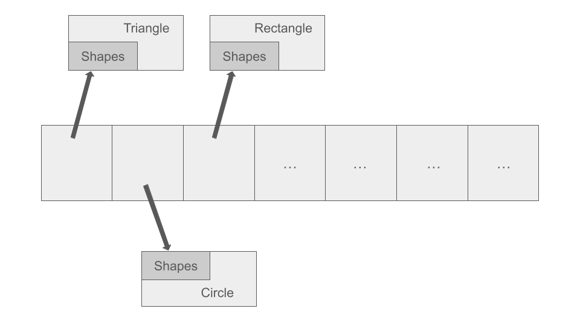
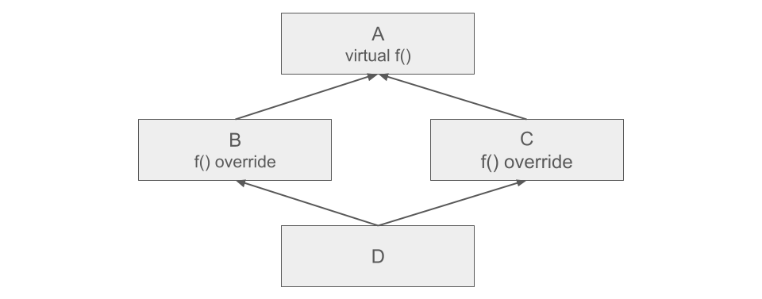
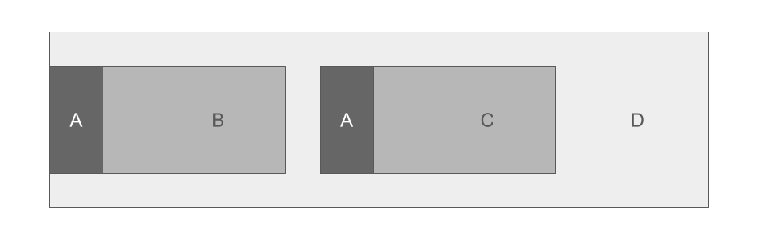
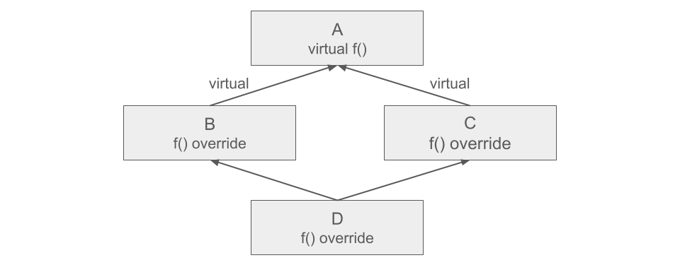
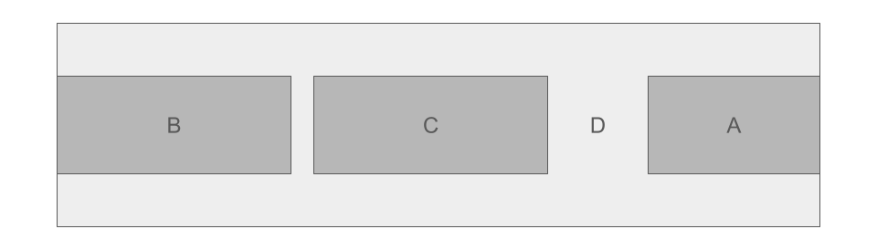

# Колекции от обекти в полиморфна йерархия (хетерогенен контейнер) 🗑️. Копиране, триене, разпознаване и прихващане на полиморфни обекти. Множествено наследяване. 💎 Диамантен проблем 💎. Виртуално наследяване.

## Колекции от обекти в полиморфна йерархия

### Хетерогенен контейнер

Можем да реализираме колекция от различни типове (но с общ базов клас), чрез масив от указатели. <br />
Указателите трябва да са от типа на базовия клас. <br />

```c++
class Fruit {
public:
	virtual void printColor() const = 0;
	virtual ~Fruit() = default;
};

class Apple : public Fruit {
public:
	void printColor() const override {
		std::cout << "Red or green!\n ";
	}
};

class Orange : public Fruit {
public:
	void printColor() const override {
		std::cout << "Orange!\n";
	}
};

class Lemon : public Fruit {
public:
	size_t sourness;

	Lemon(size_t sourness) : sourness(sourness) {}

	void printColor() const override {
		std::cout << "Yellow!\n";
	}
};

class FruitStore {
private:
	Fruit** fruits;
	size_t capacity;
	size_t count;
public:
	FruitStore();
	FruitStore(const FruitStore&);
	FruitStore& operator=(const FruitStore&);
	~FruitStore();

	void addApple();
	void addOrange();
	void addLemon(size_t sourness);
private:
	void copyFrom(const FruitStore& other);
	void free();
};

void FruitStore::addApple() {
	fruits[count++] = new Apple();
}

void FruitStore::addOrange() {
	fruits[count++] = new Orange();
}

void FruitStore::addLemon(size_t sourness) {
	fruits[count++] = new Lemon(sourness);
}
```

## Триене

Понеже имаме виртуален деструктор в базовия клас, не се интересуваме в колекцията какви са обектите, които трием.

```c++
void FruitStore::free() {
	for(size_t i = 0; i < count; ++i) {
		delete fruits[i];
	}

	delete[] fruits;
}
```

## Копиране

Искаме да реализираме копиране на колекцията. <br />
Това трябва да стане без да нарушаваме абстракцията - искаме обеките да се копират без да се налага да запитваме за техния тип. <br />
За това дефинираме виртуална функция clone, която ще връща копие на обекта. Тази функция я разписваме във всеки от наследниците. <br />

```c++
class Fruit {
public:
    virtual void printColor() const = 0;
    virtual Fruit* clone() const = 0;

    virtual ~Fruit() = default
};

class Apple : public Fruit {
public:
    void printColor() const override {
	    std::cout << "Red or green!\n";
    }

    Fruit* clone() const override {
        return new Apple(*this);
    }
};

class Orange : public Fruit {
public:
    void printColor() const override {
	    std::cout << "Orange!\n";
    }

    Fruit* clone() const override {
	    return new Orange(*this);
    }
};

class Lemon : public Fruit {
public:
    size_t sourness;

    Lemon(size_t sourness) : sourness(sourness) {}

    void printColor() const override {
	    std::cout << "Yellow!\n";
    }

    Fruit* clone() const override {
	    return new Lemon(*this);
    }
};
```

От тук копирането става тривиално:

```c++
void FruitStore::copyFrom(const FruitStore& other) {
	fruits = new Fruit*[other.capacity];

	for(size_t i = 0; i < other.count; ++i) {
		fruits[i] = other.fruits[u]->clone();
	}

	count = other.count;
	capacity = other.capacity;
}
```

## Разпознаване и прихващане

В даден момент ще достигнем до следната ситуация било то с фигури или друга йерархия. Нека за пример имаме следната йерархия:

Базов клас: `Shape`

Наследници на `Shape`: `Circle`, `Rectangle`, `Triangle`

Представете си, че имаме колекция от фигури (`Shape**`), в която всеки поинтър сочи към различен наследник на фигура.
**Хетерогенен контейнер**
- Масив от указатели към базов клас (полиморфни обекти)
```c++
Shapes** data = new Shapes*[N];
```



Искаме да изберем две произволни фигури от колекцията и да разберем дали се пресичат. Тук се появява следният проблем - няма еднаква формула, по която да определим дали една фигура се пресича с друга. Проверката дали се пресичат зависи изцяло от това кои конкретни наследници на `Shape` са двете фигури. Тоест дали триъгълник се пресича със кръг е една формула, триъгълник с триъгълник е друга формула и т.н.

Всичко това води до ситуацията ние да разберем какви фигури стоят от двете страни, за да знаем коя формула да приложим.

**Вариант 1: Да нарушим абстракцията.**

Директно да разберем към какво сочи всеки `Shape*` с 3 if проверки и `dynamic_cast`. Сами можем да предположим, че това не е правилното решение.

**Вариант 2: Visitor design pattern.**

- Накратко какво е design pattern - шаблон (това не е парче код, което copy-paste и да тръгне магически), по който се решават често срещани проблеми в обектно-ориентирания свят. В нашия случай не знаем какво седи зад двата указателя, но искаме да изпълним действие в зависимост какво седи отзад, без да нарушаваме абстракция - Visitor design pattern.
- [Visitor explained - Refactoring Guru](https://refactoring.guru/design-patterns/visitor)

В нашата ситуация искаме да постигнем

```c++
Shape* s1 = generateRandomShape()
Shape* s2 = generateRandomShape();
std::cout << s1.intersectsWith(s2);
```

Решение е в базовия клас да се добавят следниет функции:

```c++
virtual bool intersectsWith(const Shape* other) const = 0;

virtual bool intersectsWithTriangle(const Triangle* other) const = 0;
virtual bool intersectsWithRectangle(const Rectangle* other) const = 0;
virtual bool intersectsWithCircle(const Circle* other) const = 0;
```

Последните 3 са конкретните имплементации на това как нашата фигура(съответно някой от наследниците) дали се пресича с всички останали. Всяка фигура трябва да даде тяхна имплементация.

В нашият случай с s1 и s2 и от двете страни седят базови поинтъри(абстракции) и не знаем към какво сочат, а искаме да достигнем до конкретна intersectWithX функция, която да даде резултат (т.е. да свалим абстракциите от двете страни и да достигнем да конкретика и от двете страни, за да знаем коя е функцията.

На първо място на s1 и s2 извикваме intersect, понеже тя е pure virtual ние ще идем до **конкретна** имплементация в наследник. Достигайки там, ние вече ще знаем в кой клас се намираме (благодарение на this pointer).

Нека за примера приемем, че `s1 е Circle` и при `s1.intersectWith(s2)` достигаме до intersectWith на Circle

```c++
bool Circle::intersectsWith(const Shape* other) const {
	return other->intersectsWithCircle(this);
}
```

В тази функция ние знаем, че this е `Circle* const`. Вече знаем, че s1 е кръг, но нямаме идея какво е s2 (в scope-a на функцията това е `const Shape* other` параметъра). Следователно извикваме функцията за сечение с кръг на s2. От там отново ще достигнем до конкретна имплементация на `intersectsWithCircle` на някой от наследниците, която ще държи логиката за това дали се пресича кръг със съответния наследник на Shape.
Т.е. В тази функция ще знаем и s2 кой от трите наследни е.

Извод:
При всяко извикване на `virtual` функция на `Base*` ние стигаме до **конкретна** имплементация на наследник(т.е. "разкриваме" така да кажем какво седи отзад). В нашата задача и от двете страни седеше абстракция, съответно ни трябваше извикване на две virtual функции, за да достигнем до контретиката.

Kодът за ShapeCollection може да видите [тук](https://github.com/StefanShivarov/object-oriented-programming-fmi-2024-25/tree/main/Week%2012/ShapesCollection)

---

## Множествено наследяване

Множественото наследяване в C++ позволява на даден клас да наследи повече от един базов клас.

```cpp
#include <iostream>
using namespace std;

class Person {
public:
    void identify() { cout << "I am a person.\n"; }
};

class Male {
public:
    void gender() { cout << "I am male.\n"; }
};

class Student : public Person, public Male {};

int main() {
    Student s;
    s.identify(); // от Person
    s.gender();   // от Male
}

```
### Пример 2:


### Конструктори и деструктори при множествено наследяване:
```c++
struct MyClass : SuperClass1, SuperClass2, SuperClass3, SuperClass4
{
	MyClass()
	{
		std::cout << "MyClass()" << std::endl;
	}
	~MyClass()
	{
		std::cout << "~MyClass()" << std::endl;
	}
};

int main()
{
	MyClass obj;
}
```


### Копиране при множествено наследяване:
```c++
MyClass(const MyClass& other) : SuperClass1(other), SuperClass2(other), SuperClass3(other), SuperClass4(other)
{
	copyFrom(other);
}

MyClass(const MyClass& other)
{
	if (this != &other)
	{
		SuperClass1::operator=(other);
		SuperClass2::operator=(other);
		SuperClass3::operator=(other);
		SuperClass4::operator=(other);

		free();
		copyFrom(other);
	}
}
```

---

## [Диамантен проблем](https://www.geeksforgeeks.org/diamond-problem-in-cpp/)


```c++
//Indicate problem

#include <iostream>

class SuperClass {
public:
    SuperClass() {
        std::cout << "SuperClass default constructor is called\n";
    }
};

class A : public SuperClass {
public:
    A() {
        std::cout << "A default constructor is called\n";
    }
};

class B : public SuperClass {
public:
    B() {
        std::cout << "B default constructor is called\n";
    }
};

class C : public A, public B {
public:
    C() {
        std::cout << "C default constructor is called\n";
    }
};

int main() {
    C obj;
}
```

**Output:**

```
SuperClass default constructor is called
A default constructor is called
SuperClass default constructor is called //<------------
B default constructor is called
C default constructor is called
```

Конструктора на `SuperClass` бива извикан 2 пъти, а ако имахме и деструктор - той също щеше да бъде извикан 2 пъти.

Тоест, обектът `obj` има 2 копия на всички данни на базовия клас `SuperClass`, което предизвиква двусмислия/неяснотии (ambiguous behaviour).

---




- В класа **D** сме задължени да презапишем **f()**
- В следната ситуация имаме потенциален проблем, защото се получава дублиране на памет при създаването на класа **A**. Решението на този проблем е да използваме виртуално наследяване

#### Представяне в паметта



#### Извикване на конструктори

```c++
A(), B(), A(), C(), D()
```

#### Извикване на деструктори

```c++
~D(), ~C(), ~A(), ~B(), ~A()
```


## Виртуално наследяване

Решението на горният проблем е използването на виртуално наследяване. <br />
Класовете А и В трябва да наследят виртуално SuperClass, за да избегнем 2-те копия на SuperClass.

Когато използваме keyword: virtual при наследяване, конструкторът по подразбиране на прародителя се извиква по подразбиране, дори ако родителските класове извикват изрично конструктор с параметри. Тоест всеки наследник на клас, който наследява друг като virtual, трябва да избере кой конструктор се вика на прародителя(виртуално наследения клас). В случая C, трябва експлицитно да каже кой конструктор на SuperClass да се извика. <br />

```c++
#include <iostream>

class SuperClass {
public:
    SuperClass() {
        std::cout << "SuperClass default constructor is called\n";
    }
};

class A : virtual public SuperClass {
public:
    A() {
        std::cout << "A default constructor is called\n";
    }
};

class B : virtual public SuperClass {
public:
    B() {
        std::cout << "B default constructor is called\n";
    }
};

class C : public A, public B {
public:
    C() {
        std::cout << "C default constructor is called\n";
    }
};

int main() {
    C obj;
}
```

**Output:**

```
SuperClass default constructor is called
A default constructor is called
B default constructor is called
C default constructor is called
```

### Пример 2

- За да избегнем дублиране на памет, можем да използваме виртуално наследяване. Когато клас наследява виртуално друг клас, всички наследници надолу по йерархията са длъжни да инстанцират
първия клас (най-отгоре в йерархията). Ако това не го направим, се извиква **default** constructor, дори някой от наследниците по йерархията да извиква конструктор с параметри

```c++
class X : virtual Y { };
```

- Всеки наследник на **X** (пряк и непряк) е отговорен за създаването на **Y**
- Очакваме обектът **Y** да се споделя и от други наследници



#### Представяне в паметта



#### Извикване на конструктори

- След добавяне на **virtual**, преди да се извика конструктор на родител, се прави проверка дали този конструктор вече не е бил извикан

```c++
A(), B(), C(), D()
```

#### Извикване на деструктори

- Деструкторите се извикват в обратен ред на деструкторите, като там се прави същата проверка дали деструкторът вече е извикан

```c++
~D(), ~C(), ~B(), ~A()
```


### 🔍 Механизъм: Делта отстояние

Когато достъпваме виртуално наследен клас, адресът не може да бъде изчислен със статичен офсет. Компилаторът използва виртуална таблица (vtable), която съдържа offset за всяка ф-я, за да намери реалния адрес на функцията.

Пример:

```cpp
class Person {
public:
    virtual void whoami() {
        cout << "Person\n";
    }
};

class Male : virtual public Person {};
class Female : virtual public Person {};
class Student : public Male, public Female {};

void call(Person* p) {
    p->whoami();
}

int main() {
    Student s;
    call(&s); // pointer to virtual Base
}
```

Компилаторът генерира vtable със специален вход, съдържащ офсет до Person.
Когато call(&s) се извика, реалният адрес до Person се изчислява чрез:

```cpp
real_ptr = (char*)&s + delta_to_virtual_base;
```

### Delta отстояние

Паметта на `Student` (виртуално наследяване):

```
[ Student ]
├── Male (vptr_Male)
├── Female (vptr_Female)
└── Person
```

vptr_Male и vptr_Female сочат към виртуални таблици, които съдържат:

- Функции
- Делта отстояния

---

## Теоретична задача

```plaintext
					  A
		  virtual f(), g(), h(), k()
			  /                \
		  B                        C
	g() override()             f() override
			  \                /
					  D
				h() override
```

| Function    | Δ                |
| ----------- | ---------------- |
| A::k()      | 0                |
| B::g()      | -Δ(A)            |
| C::f()      | -Δ(A) + Δ(C)     |
| D::h()      | -Δ(A)            |


### За повече информация по темата, може да погледнете [тази презентация](https://learn.fmi.uni-sofia.bg/pluginfile.php/138192/mod_resource/content/0/multinheritance.pdf).
