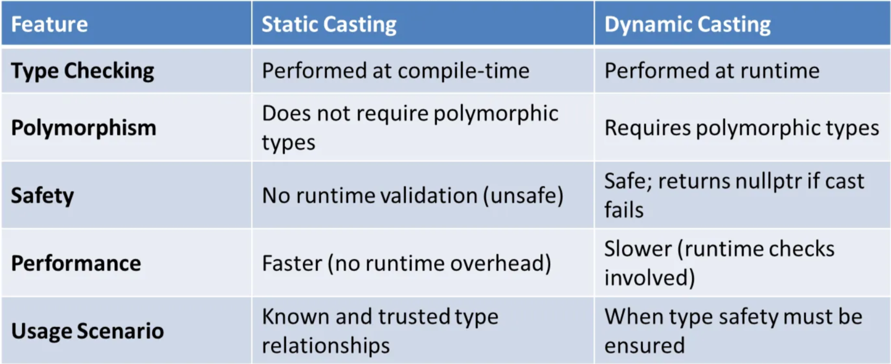
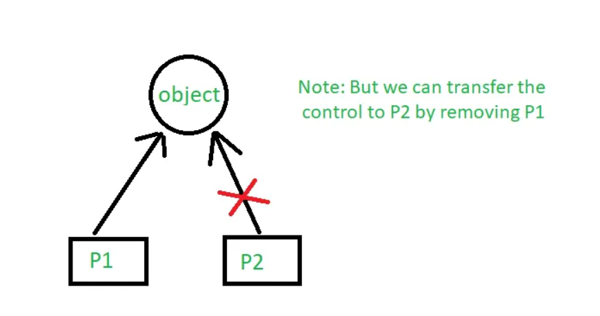
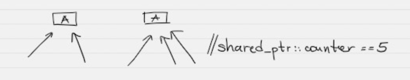
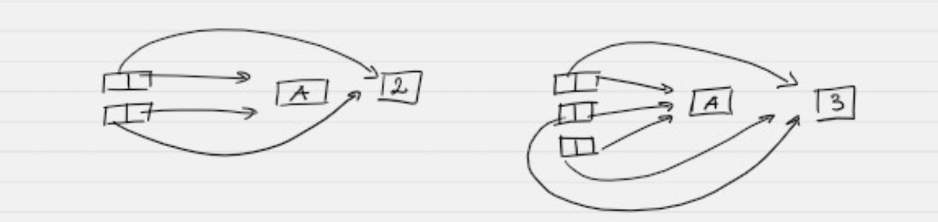
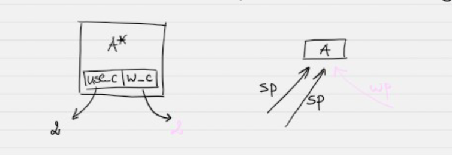
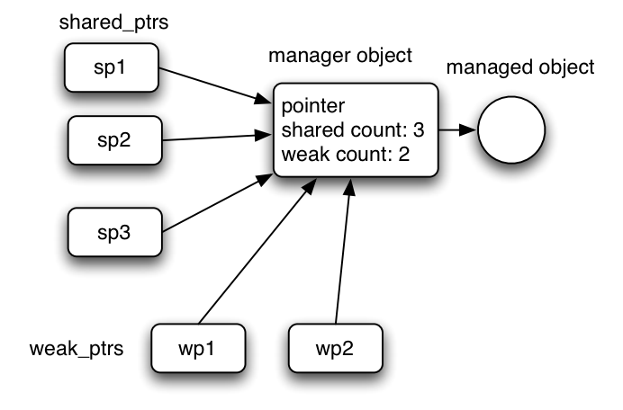
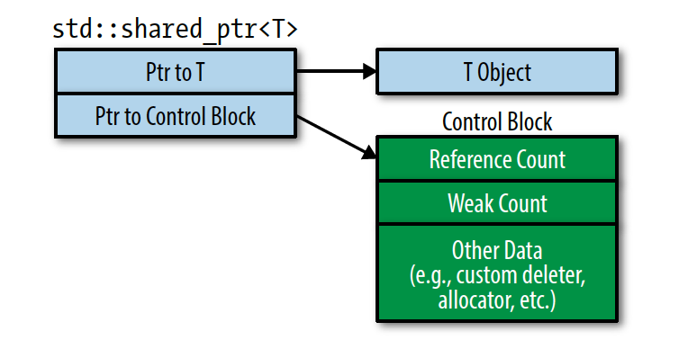

# Type casting

Унарен оператор(unary operator), който принуждава един тип данни да бъде преобразуван в друг тип данни.
- [static_cast](.)
- [dynamic_cast](.)
- [const_cast](.)
- [reinterpret_cast](.)
- [(T) - C-style cast](.)

## Static cast
**Дефиниция:**
Статичното преобразуване (casting) се използва за преобразуване на типове по време на компилация. То не извършва проверки по време на изпълнение, така че трябва да се уверите, че преобразуването е валидно. Неправилна употреба на статично преобразуване може да доведе до `undefined behavior`

- Приема като аргумент `T*` или `T&`
  
**Примери за употреба:**

- Преобразуване между свързани типове, като преобразуване на указател на базов клас към указател на производен клас.
- Преобразуване на `void указатели` обратно към оригиналния им тип.
- Default cast-a за implicit conversions например `int` към `float`
- Използва се за преобразуването на примитивни типове
- Може да е implicit или explicit
- Compile time
#### Примери:
```c++
#include <iostream>
class Base {
public:
    void show() { std::cout << "Base class\n"; }
};

class Derived : public Base {
public:
    void show() { std::cout << "Derived class\n"; }
};

int main() {
    Base* basePtr = new Derived();
    Derived* derivedPtr = static_cast<Derived*>(basePtr); // Downcasting

    derivedPtr->show(); // Output: Derived class
    delete basePtr;
    return 0;
}
```
- `Static Cast` преобразува **basePtr** (Base*) в **Derived**. Ние поемаме отговорност за осигуряване на валидността на преобразуването.
- Тъй като **basePtr** всъщност сочи към **Derived** обект, извикването на метода работи както се очаква.
```c++
    float f = 3.5;
    int a = f; // C-style casting /implicit
    int b = static_cast<int>(f); //explicit static_cast
```

```c++
    class Base {};
    class Derived : public Base {};

    Derived d1;
    Base* b1 = (Base*)(&d1);
    Base* b2 = static_cast<Base*>(&d1);
```
Ще се комплира без проблем.
- взехме адреса на d1 и експлицитно го преобразувахме към Base.
- взехме адреса на d1 и използвахме static_cast, за да го преобразувахме към Base.

Както знаем, static_cast извършва строга проверка на типа:
```c++
    class Base {};
    class Derived : private Base {}; // Inherited private/protected not public

    Derived d1;
    Base* b1 = (Base*)(&d1); // allowed
    Base* b2 = static_cast<Base*>(&d1);
```
Дори и ако наследяваме protected, кодът няма да се компилира.(само при public, като при горния пример няма да има проблем).
```
[Error] Conversion to inaccessible base class is not allowed
```

To and from void pointer:
```c++
    int i = 10;
    void* v = static_cast<void*>(&i);
    int* ip = static_cast<int*>(v);
```

## Dynamic cast
Дефиниция:
Динамичното преобразуване (casting) се използва за безопасно преобразуване надолу (downcasting) в **полиморфни класове** (класове с поне една виртуална функция). То извършва **проверка** на **типа** по време на изпълнение, за да се гарантира валидността на преобразуването.

#### Кога се използва?

- използва се при полиморфизъм за безопасно преобразуване надолу в полиморфни типови йерархии
- при cast-ване към Derived(наследник) клас.
- нужна е поне една виртуална функция.
- Осигуряване на безопасност на типа по време на изпълнение, когато точният тип на обекта е неизвестен.

| Downcasting  | Upcasting |
|  :---: |  :---: |
| Casting a base class pointer (or reference) to a derived class pointer (or reference) is known as downcasting.| Casting a derived class pointer (or reference) to a base class pointer (or reference) is known as upcasting.  |

#### Примери:
```c++
#include <iostream>
class Product {
public:
    virtual ~Product() = default; // Polymorphic class
};

class Electronics : public Product {};

int main() {
    Product* productPtr = new Electronics();
    Electronics* electronicsPtr = dynamic_cast<Electronics*>(productPtr);

    if (electronicsPtr) {
        std::cout << "dynamic_cast succeeded\n";
    } else {
        std::cout << "dynamic_cast failed!\n";
    }

    Product* invalidProductPtr = new Product();
    electronicsPtr = dynamic_cast<Electronics*>(invalidProductPtr);

    if (electronicsPtr) {
        std::cout << "dynamic_cast succeeded\n";
    } else {
        std::cout << "dynamic_cast failed!\n";
    }

    delete productPtr;
    delete invalidProductPtr;
    return 0;
}

```
#### Обяснение:
- В първия случай, productPtr сочи към обект от типа Electronics, така че преобразуването е успешно.
- Във втория случай, invalidProductPtr сочи към обект Product. Тъй като не е от тип Electronics, преобразуването е неуспешно и връща nullptr.
  
### Dynamic_cast - no virtual function example:
```c++
// no virtual function used in the Base class
    #include <iostream>
    
    // Base class declaration
    class Base {
    public:
        void print() {
            std::cout << "Base\n";
        }
    };
    
    // Derived Class 1 declaration
    class Derived1 : public Base {
    public:
        void print() {
            std::cout << "Derived1\n";
        }
    };
    
    // Derived class 2 declaration
    class Derived2 : public Base {
    public:
        void print() {
            std::cout << "Derived2\n";
        }
    };
    
    int main() {
        Derived1 d1;
    
        // Base class pointer hold Derived1 class object
        Base* bp = dynamic_cast<Base*>(&d1);
    
        // Dynamic casting
        Derived1* dp1 = dynamic_cast<Derived1*>(bp);
        if (dp1 == nullptr)
            cout << "null" << endl;
        else
            cout << "not null" << endl;
    
        return 0;
    }
```

### Dynamic_cast - with virtual function example:
```c++
    // Dynamic casting and it returns a value of type: new_type
    #include <iostream>

    // Base Class declaration
    class Base {
    public:
        virtual void print() {
            std::cout << "Base\n";
        }
    };
    
    // Derived1 class declaration
    class Derived1 : public Base {
    public:
        void print() {
            std::cout << "Derived1\n";
        }
    };
    
    // Derived2 class declaration
    class Derived2 : public Base {
    public:
        void print() {
            std::cout << "Derived2\n";
        }
    };
    
    int main() {
        Derived1 d1;
    
        // Base class pointer holding Derived1 Class object
        Base* bp = dynamic_cast<Base*>(&d1);
    
        // Dynamic_casting
        Derived1* dp1 = dynamic_cast<Derived1*>(bp);
        if (dp1 == nullptr) {
            std::cout << "null\n";
        } else {
            std::cout << "not null\n";
        }
    }
```

### Dynamic_cast - if it fails - returns a nullptr
```c++
    // If the cast fails and new_type is a pointer type,
    // it returns a null pointer of that type
    #include <iostream>
    
    // Base class declaration
    class Base {
    public:
        virtual void print() {
            std::cout << "Base\n";
        }
    };
    
    // Derived1 class declaration
    class Derived1 : public Base {
    public:
        void print() {
            std::cout << "Derived1\n";
        }
    };
    
    // Derived2 class declaration
    class Derived2 : public Base {
    public:
        void print() {
            std::cout << "Derived2\n";
        }
    };
    
    int main() {
        Derived1 d1;
        Base* bp = dynamic_cast<Base*>(&d1);
    
        // Dynamic Casting
        Derived2* dp2 = dynamic_cast<Derived2*>(bp);
        if (dp2 == nullptr) {
            std::cout << "null\n";
        } else {
            std::cout << "not null\n";
        }
    
        return 0;
    }
```

### Handle cast fail - std::bad_cast
```c++
    #include <exception>
    #include <iostream>

    // Base class declaration
    class Base {
    public:
        virtual void print() {
            std::cout << "Base\n";
        }
    };
    
    // Derived1 class
    class Derived1 : public Base {
    public:
        void print() {
            std::cout << "Derived1\n";
        }
    };
    
    // Derived2 class
    class Derived2 : public Base {
    public:
        void print() {
            std::cout << "Derived2\n";
        }
    };
    
    int main() {
        Derived1 d1;
        Base* bp = dynamic_cast<Base*>(&d1);
    
        // Type casting
        Derived1* dp1 = dynamic_cast<Derived1*>(bp);
        if (dp1 == nullptr) {
            std::cout << "null\n";
        } else {
            std::cout << "not null\n";
        }
    
        // Exception handling block
        try {
            Derived2& r1 = dynamic_cast<Derived2&>(d1);
        } catch (std::exception& e) {
            std::cout << e.what() << std::endl;
        }
    }
```
### Разлики между **static_cast** и dynamic_cast

## Const cast
- използва се за добавяне/премахване на const към променлива
- добавяне/премахване на constness на променлива

Променяне на non-const members в const member function
```c++
    #include <iostream>

    class Student {
    private:
        int roll;
    public:
        // constructor
        Student(int r) :roll(r) {}

        // A const function that changes roll with the help of const_cast
        void f() const {
            (const_cast<Student*>(this))->roll = 5;
        }

        int getRoll() const {
            return roll;
        }
    };

    int main() {
        Student s(3);
        std::cout << "Old roll number: " << s.getRoll() << std::endl;

        s.f();

        std::cout << "New roll number: " << s.getRoll() << std::endl;
    }
```

Подаване на const data на функция, която не приема const:
```c++
    #include <iostream>

    int fun(int* ptr) {
        return (*ptr + 10);
    }

    int main() {
        const int VAL = 10;

        const int* ptr = &VAL;

        std::cout << fun(const_cast<int*>(ptr));
    }
```

Модифициране на променлива, която е първочално декларирана като const - **Undefined behaviour**
```c++
    #include <iostream>

    int fun(int* ptr) {
        *ptr = *ptr + 10;
        return (*ptr);
    }
    
    int main() {
        const int VAL = 10;
        
        const int *ptr = &VAL;
        
        fun(const_cast<int*>(ptr));
        
        std::cout << VAL;

        return 0;
    }
```

Modify a non-const:
```c++
    #include <iostream>

    int fun(int* ptr) {
        *ptr = *ptr + 10;
        return (*ptr);
    }
    
    int main() {
        int val = 10;

        const int *ptr = &val;
        
        fun(const_cast<int*>(ptr));
        
        std::cout << val;

        return 0;
    }
```

Type of cast is not the same as original object:
```c++
    int a1 = 40;
    const int* b1 = &a1;
    char* c1 = const_cast <char*>(b1); // compiler error
    *c1 = 'A';
```

```
[ERROR]: invalid const_cast from type 'const int*' to type 'char*'
```

## Reinterpret cast
Използва се за преобразуването на pointer oт даден тип към pointer oт друг тип, дори когато типовете несъвпадат.
Не проверява дали 2-та типа са еднакви.

- reinterpret bit patterns(битови модели)
- it can typecast any pointer to any other data type.
- It is used when we want to work with bits.

```
Е.g:
   Превръщане на поток от необработени данни в действителни данни;
   Съхраняване на данни в ниските битове на подравнен указател;
```

### Basic example:
```c++
    int* p = new int(65);
    char* ch = reinterpret_cast<char*>(p);
    std::cout << *p << std::endl; //65
    std::cout << *ch << std::endl; //A
    std::cout << p << std::endl; //0x1609c20 - address
    std::cout << ch << std::endl; //A
```

### Struct/Class example:
```c++
    #include <iostream>

    // Creating structure myStruct
    struct myStruct {
        int x;
        int y;
        char c;
        bool b;
    };

    int main() {
        myStruct s;

        // Assigning values
        s.x = 5;
        s.y = 10;
        s.c = 'a';
        s.b = true;

        // data type must be same during casting as that of original

        // converting the pointer of 's' to pointer of int type in 'p'.
        int* p = reinterpret_cast<int*>(&s);

        // printing the value currently pointed by *p
        std::cout << *p << std::endl;

        // incrementing the pointer by 1
        p++;

        // printing the next integer value
        std::cout << *p << std::endl;

        // incrementing the pointer by 1
        p++;

        // we are casting back char* pointed by p using char *ch.
        char* ch = reinterpret_cast<char*>(p);

        // printing the character value pointed by (*ch)
        std::cout << *ch << std::endl;

        // incrementing the pointer by 1
        ch++;

        //since (*ch) now points to boolean value,
        //it is required to access the value using same type conversion
        //so we have used data type of *n to be bool.

        bool* n = reinterpret_cast<bool*>(ch);
        std::cout << *n << std::endl;

        // we can also use this line of code to print the value pointed by (*ch).
        std::cout << *(reinterpret_cast<bool*>(ch));
    }
```

### Class/Inheritance example:
```c++
    #include <iostream>
    
    class A {
    public:
        void fun_a(){
            std::cout << "in class A\n";
        }
    };
    
    class B {
    public:
        void fun_b(){
            std::cout << "in class B\n";
        }
    };
    
    int main() {
        B* x = new B();
    
        A* new_a = reinterpret_cast<A*>(x);
    
        new_a->fun_a();

        return 0;
    }
```
## C-Style cast
```c++
A* ptr = (B*) ptr;
```
До сега сме правили C-Style Cast това е комбинация от всички изброени долу кастове!

1. const_cast
2. static_cast
3. static_cast + const_cast
4. reinterpret_cast
5. reinterpret_cast + const_cast


# Добри Практики!
### 1. Използвайте `dynamic_cast`, когато работите с полиморфни типове, а безопасността е от решаващо значение.
### 2. Използвайте `static_cast` само когато сте сигурни във връзката между типовете.
### 3. Препоръчително е да избягвате преобразувания(cast), когато е възможно, като използвате `design patterns` 
---
#  Умни указатели в C++

Умен указател е обвиващ клас за обикновен указател, който **менажира автоматично паметта** на обекта, към който сочи.

**Цел:** Да не използваме директно `new` и `delete`, с цел да не пропуснем да изтрием даден ресурс.

При създаване с `new`, умният указател поема собствеността над обекта. При изтриване — автоматично извиква деструктора му.

---

## 1.  `auto_ptr` – deprecated (остарял)

> Не се използва в modern C++, запазен само за поддръжка на стар код.

### Пример:
```cpp
#include <memory>
auto_ptr<A> ptr(new A());
```
## 2.  `unique_ptr` – точно един указател за точно един ресурс

`unique_ptr` гарантира, че **само един указател притежава даден ресурс**.  
Не позволява копиране – само **прехвърляне на собственост** чрез `std::move`.

---

###  Основни характеристики

- Автоматично освобождава ресурс при излизане от обхват
- **Няма копиране** (`copy constructor` и `operator=` са изтрити)
- Има **move семантика**
- Идеален за случаите, когато ресурс се използва **само на едно място**

---



### Синтаксис с `make_unique`

```cpp
#include <iostream>
class A {
public:
    A(int a, bool b) { /*...*/ }
    ~A() { /*...*/ }
};

int main() {
    std::unique_ptr<A> up = std::make_unique<A>(2, true);
    // автоматично извиква конструктора A(2, true)
} // При изход от main() се извиква ~A()
```
```c++
make_unique<T>(....) - се използва вместо new
```

###  Защо да използваме `make_unique` вместо `new`?
 - Избягва memory leak при изключения
```c++
std::unique_ptr<A> up(new A(2, true));
// ако между new и инициализация възникне изключение — паметта не се освобождава
```

`make_unique<A>(...)` прави всичко в една стъпка, така че ако нещо се обърка — няма теч на памет.

- Функцията `make_unique<T>(параметри за констуктора)` - шаблонна функция, която приема параметрите, нужни за създаването на `T`, извика вътрешно `new` и връща unique_ptr към обекта.
  
- Забранени са `Копиращ Конструктор` и `оп=`, защото искаме да е един, трябва да има move семантика
##### Забранено копиране

```cpp
std::unique_ptr<A> up1 = std::make_unique<A>(2, true);
std::unique_ptr<A> up2 = up1;              // ❌ Грешка: забранено копиране
std::unique_ptr<A> up3 = std::move(up1);   // ✅ Прехвърляне на собственост
```
  
- Ще се счупи, ако към към предварително създаден обект насочиме два `unique_ptr`. Нито един от тях не подозира за съществуването на другия тоест при изтриването на единия паметта ще се изтрие и деструкторът на втория ще гръмне.
##### Два `unique_ptr` към един и същи обект

```c++
#include <iostream>
using namespace std;
class A {
};
int main()
{
    A* a = new A();
    unique_ptr<A> up1(a);
    unique_ptr<A> up2(a);
} -> ще гръмне, защото се опитва да изтрие празни данни(вече е бил изтрит от up2 и up1 гърми).
```

#####  Грешен пример с `make_unique`

```c++
class A{

}
int main() {
    A* a = new A();
    unique_ptr<A> up1=make_unique<A>(а); // Това ще даде грешка защото търси конструктор A(A*)
    unique_ptr<A> up2=make_unique<A>(а); // съшото
} 
```
`make_unique<A>(a)` се опитва да извика конструктор `A(A*)`, който не съществува → компилационна грешка.

---

## 3. `shared_ptr` – 1 обект, но много указатели (споделена собственост)

деф: Клас, който пази указател към обект и брояч колко указатели са насочени към обекта.

`shared_ptr` е умен указател, който позволява **много указатели към един и същ обект**.  
Всеки `shared_ptr` увеличава вътрешния **референтен брояч**, и когато той достигне 0 – обектът се изтрива.

---

###  Основни характеристики

- Обектът се създава при първия `shared_ptr`
- Новите `shared_ptr` копират (shallow) оригинала и увеличават брояча
- Обектът се изтрива, когато последният `shared_ptr` изчезне (когато брояча стане 0)

---
### Синтаксис - Пример

```cpp
#include <iostream>
#include <memory>

class A {
public:
    A(int x, int y) { std::cout << "A(" << x << "," << y << ")
"; }
    void f() { std::cout << "A::f()
"; }
};

int main() {
    std::shared_ptr<A> sp = std::make_shared<A>(2, 3);
    std::shared_ptr<A> sp2 = sp;
    std::shared_ptr<A> sp3 = sp;

    sp2.reset();
    sp3.reset();

    sp->f(); // Вика метода, ако обектът още съществува
}
```

Реализира се с:
`ìnt* ref`

##  Как да използваме `SharedPtr`

### 1. Създавай **точно един** `SharedPtr` от суров указател  
```cpp
A* p = new A();           // 1) заделяне на обекта
SharedPtr<A> sp1(p);         // 2) създаваме контролен блок (refCount = 1)
```
### 2. Всички останали споделени указатели се правят `чрез копиране`
```c++
SharedPtr<A> sp2 = sp1;      // copy-ctor / operator= → refCount става 2
```
## ВАЖНО!!!
```c++
Никога не конструирай втори SharedPtr от същия T*!
Това ще създаде нов брояч и при освобождаване ще доведе до двойно delete.
```
#### Пример:
```c++
int* p = new int(42);

std::shared_ptr<int> s1(p);   // control-block #1, use_count = 1
std::shared_ptr<int> s2(p);   // control-block #2, use_count = 1  ← ГРЕШКА!

// при освобождаване:
// s1 -> delete p
// s2 -> delete p  (втори път)  → Undefined Behavior.
```
### 3. Животът на обекта приключва, когато броячът стигне 0
```c++
{               // вътрешен обхват
    SharedPtr<A> sp3 = sp1;  // refCount = 3
}               // sp3 излиза от обхват → refCount = 2

// … код …

// При излизане от обхвата на sp2 и sp1:
// 1) refCount → 1, после → 0
// 2) освобождава се обектът и самият брояч

```
### 4. Типични грешки

| Грешка                          | Какво става                                                  | Как да я избегнеш                          |
| ------------------------------- | ------------------------------------------------------------ | ------------------------------------------ |
| `A obj; SharedPtr<A> s1(&obj);` | Управляваш **stack**-обект → `delete` на адрес от стека → UB | Заделяй само с `new`                       |
| `SharedPtr<A> s2(&*s1);`        | втори независим брояч → двойно освобождаване                 | `SharedPtr<A> s2 = s1;`                    |
| Забравен `new` без `SharedPtr`  | изтичане на памет                                            | Винаги обвивай `new` в `SharedPtr` веднага |


###  Защо да използваме `make_shared` вместо `new`?

```cpp
// Препоръчително:
std::shared_ptr<A> sp = std::make_shared<A>(2, 3);

// Остарял По-рисков начин:
std::shared_ptr<A> sp(new A(2, 3));
```

| Критерий                       | ✅ `std::make_shared`                     | ❌ `std::shared_ptr(new T(...))`         |
|-------------------------------|-------------------------------------------|-------------------------------------------|
| **Брой алокации на памет**     | 1 (обект + контролен блок заедно)        | 2 (отделни malloc-и)                      |
| **Ефективност**                | По-бързо, по-добър кеш                   | По-бавно                                  |
| **Безопасност при изключения** | Да – няма шанс за memory leak            | Не – възможен leak                        |
| **Синтаксис**                  | Кратък и ясен                            | По-дълъг и по-рисков                      |
| **Custom deleter**             | Не директно                              | Да – подава се в конструктора             |

---


#### `shared_ptr` има предефинирани оператори `*` и `->`, копиране и местене.
- Всеки `shared_ptr` увеличава вътрешния брояч
- `Триене`
  - трием указателя => намаляваме брояча
  - последния указател изтрива обекта
  - при изтриването на последния указател, трябва да се изтрие и counter-a
- Броячът НЕ е `static`, защото ще се споделя между различни обекти`shared_ptr`
  

- пазим указател към външна памет, която пази бройката



## 4.  `weak_ptr` – слаба (non-owning) връзка
`weak_ptr` е умен указател, който **не притежава обекта**, а само го наблюдава.

###  Основни характеристики

- Сочи към обект, менажиран от `shared_ptr`
- Не увеличава референтния брояч
- не влияе на триенете и може да сочи към вече изтрит обект
- `weak_ptr` трябва да има проверки дали обектът е изтрит
- Използва се за:
  - проверка дали обектът още съществува(като индикатор дали дадено нещо е живо или не.)
  - избягване на циклични зависимости

---

##### Реализация:
има брояч за броя на `shared_ptr` сочещи към обекта + брояч за броя на `weak_ptr` сочещи към обекти

**Counter** - Съдържащ 2 int числа някъде в паметта





###  Пример с `weak_ptr`

```cpp
#include <memory>
#include <iostream>

int main() {
    std::shared_ptr<int> sp = std::make_shared<int>(42);
    std::weak_ptr<int> wp = sp;

    if (auto locked = wp.lock()) {
        std::cout << "Обектът е жив: " << *locked << std::endl;
    } else {
        std::cout << "Обектът е изтрит
";
    }
}
```

###  Как работи вътрешно?

- Контролният блок съдържа:
  - `use_count` → брой `shared_ptr`
  - `weak_count` → брой `weak_ptr`\
    - 1, use_count>=1
    - 0, use_count=0

- `shared_ptr` отговаря за изтриването на `A`  а weak_ptr отговаря за изтриване на `Counter`
- Кога се трие обекта: `use_count = 0`
- Кога се трие брояча: `weak_count = 0`
- Контролният блок се изтрива при: `use_count == 0 && weak_count == 0`

---





## 5. `PolymorphicPtr<T>` – собствена имплементация на полиморфен указател

`PolymorphicPtr<T>` е собствена имплементация на **умен указател с полиморфно поведение**, който:

- Позволява **стойностно копиране** на обекти от базов тип (напр. `Base`) без нужда от `shared_ptr`, `unique_ptr` или `clone()` извън класа.
- **Изисква единствено обектите да поддържат метод `clone()`**, който връща копие на текущия обект (`T* clone() const`).
- Може да се използва безопасно в **хетерогенни контейнери** като `Vector<PolymorphicPtr<Base>>`.
- Замества `Base**` в **хетерогения контейнер** със `Vector<PolymorphicPtr<Base>>` и не трябва да пишем `BIG 6`

---

### 🛠️ Интерфейс и поведение

```cpp
template <class T>
class PolymorphicPtr {
    T* data = nullptr;

    void free();                        // Освобождава обекта
    void moveFrom(PolymorphicPtr&&);   // Прехвърля собственост
    void copyFrom(const PolymorphicPtr&); // Използва clone()

public:
    PolymorphicPtr() = default;
    PolymorphicPtr(T* ptr);                      // Конструктор от суров указател
    PolymorphicPtr(const PolymorphicPtr& other); // Копиращ конструктор (deep copy)
    PolymorphicPtr(PolymorphicPtr&& other);      // Move конструктор

    PolymorphicPtr& operator=(const PolymorphicPtr& other); // Копиращо присвояване
    PolymorphicPtr& operator=(PolymorphicPtr&& other);      // Move присвояване

    T* operator->();               // достъп до член-функции
    const T* operator->() const;

    T& operator*();                // достъп до обекта
    const T& operator*() const;

    T* get();
    const T* get() const;

    void reset(T* ptr);           // подмяна на обекта
    T* release();                 // освобождаване на указателя

    ~PolymorphicPtr();            // деструктор
};
```

---

### Предимства

- Позволява **стойностна семантика за обекти с виртуални методи**
- Безопасно **копиране, преместване и унищожаване**
- Работи с **хетерогенни контейнери** (`std::vector<PolymorphicPtr<Base>>`)
- Позволява използване на обекти с **виртуален интерфейс**, без `shared_ptr`, `unique_ptr`, `dynamic_cast`, и без `new` в клиентския код

---

### Пример за употреба

```cpp
struct Shape {
    virtual void draw() const = 0;
    virtual Shape* clone() const = 0;
    virtual ~Shape() = default;
};

struct Circle : Shape {
    void draw() const override { std::cout << "Circle\n"; }
    Shape* clone() const override { return new Circle(*this); }
};

struct Square : Shape {
    void draw() const override { std::cout << "Square\n"; }
    Shape* clone() const override { return new Square(*this); }
};

int main() {
    Vector<PolymorphicPtr<Shape>> shapes; // замества Shape ** в хетерогения контейнер
    shapes.emplace_back(new Circle());
    shapes.emplace_back(new Square());

    for (const auto& s : shapes)
        s->draw();
}
```

---

### Изисквания към `T` (базовия клас)

- Трябва да има **виртуален деструктор**
- Трябва да има публичен метод:
```cpp
virtual T* clone() const = 0;
```


